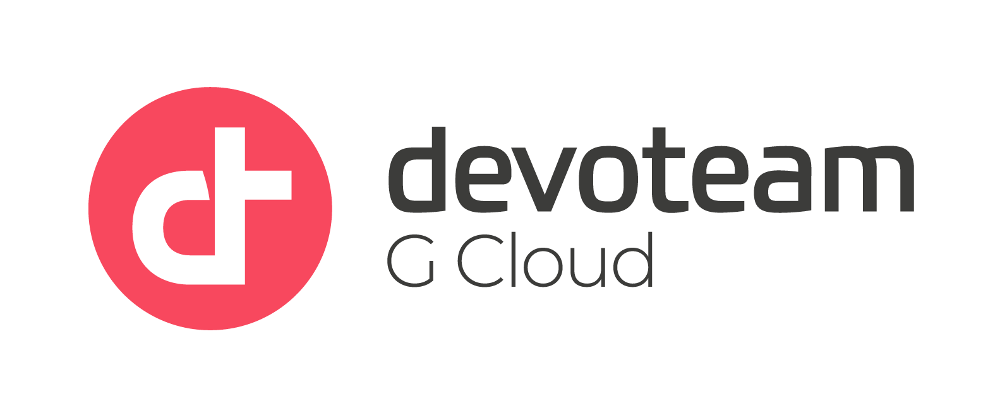

# License Plate Recognition



This project uses Cloud Vision API and Cloud Storage to recognize license plate numbers in images. It allows users to upload an image and get a list of identified license plate numbers. The project uses a manual filter such as an area threshold as well as a confidence threshold to improve the accuracy of the recognition. Users can play around with these values to get the desired output.

## Table of Contents

- [Prerequisites](#prerequisites)
- [Installation](#installation)
- [Usage](#usage)
- [Configuration](#configuration)
- [File Structure](#file-structure)
- [Technical Details](#technical-details)
- [Troubleshooting](#troubleshooting)
- [License](#license)

## Prerequisites

- Python 3.6 or later
- Google Cloud Platform account with Cloud Vision API and Cloud Storage enabled

## Installation

1. Clone the repository: `git clone https://github.com/evanfebrianto-dt/id-smu-lpr-app-engine.git`
2. Navigate to the directory: `cd `
3. Install the required libraries: `pip install -r requirements.txt`

## Usage

1. Run the main program: `streamlit run LicensePlateRecognition.py --server.port $PORT`
2. Follow the prompts in the app to upload an image and recognize license plate numbers.

## Configuration

1. Create a new project in the [Google Cloud Console](https://console.cloud.google.com/).
2. Enable the Cloud Vision API and Cloud Storage APIs for the project.
3. Create a new bucket in Cloud Storage.
4. Set the following environment variables with your GCP project ID and desired server port:
   - `PROJECT_ID`
   - `PORT`
5. Inside `config/config.py`, you can also configure the `PROJECT_ID`, `BUCKET_NAME`, and `FOLDER_PATH_IN_BUCKET` variables with your GCP project ID, bucket name, and desired folder path in your bucket, respectively.
6. Create `.streamlit/secrets.toml` and add `password=[your-desired-password]`

## File Structure
```
LicensePlateRecognition/
├── assets
│   └── devoteam_logo.png
├── config
│   └── config.py
├── utils
│   ├── ocr.py
│   └── storage.py
├── app.yaml
├── cloudbuild.yaml
├── Dockerfile
├── LICENSE
├── LicensePlateRecognition.py
├── README.md
└── requirements.txt
```


## Technical Details

The project uses the following technologies:

- Google Cloud Vision API for text detection in images
- Google Cloud Storage for storing and retrieving images
- Streamlit for creating the user interface
- OpenCV for image processing

The project uses the following algorithms:

- Optical Character Recognition (OCR) to detect text in images

## Troubleshooting

If you encounter an error when running the app, check the following:

- Make sure you have set the required environment variables with your GCP project ID and desired server port.
- Make sure you have enabled the Cloud Vision API and Cloud Storage APIs for your GCP project.
- Make sure you have installed all required libraries listed in `requirements.txt`.

## License

This project is licensed under the MIT License. See the [LICENSE](LICENSE) file for details.

